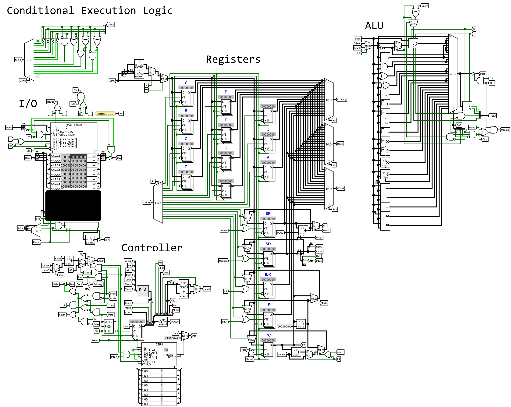

# bit32
## Repository for my homebrew CPU design "bit32"

Created a 32-bit CPU as an excercise

Included are the following:
- bit32 circuit file
- Image of the circuit
- Basic assembler and a C compiler
- Documentation for the bit32 CPU

